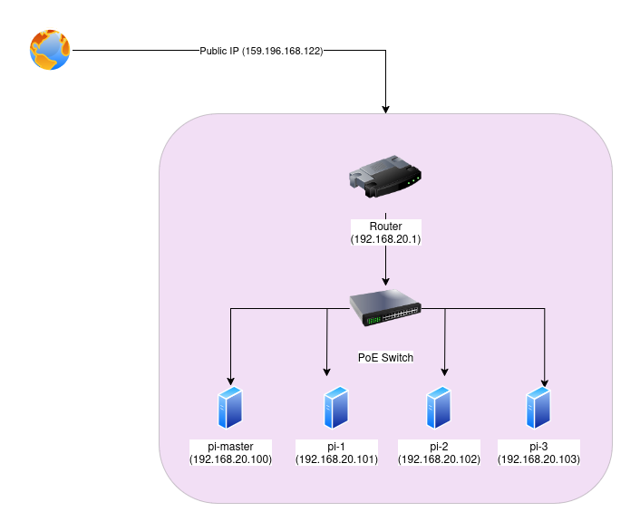
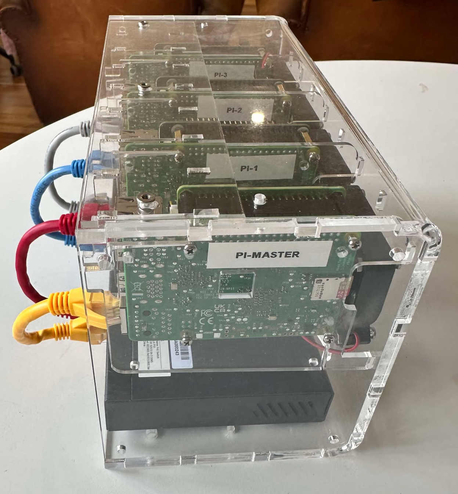
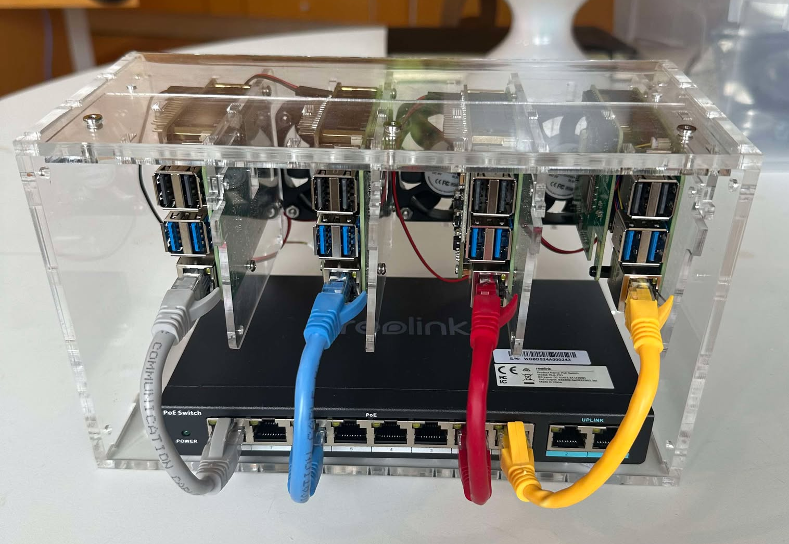

# 0 - 100 with Kubernetes

This repository documents the setup and configuration of my 4-node Kubernetes homelab cluster, built on Raspberry Pi 5 devices. The cluster is designed to deliver high availability (HA) while remaining lightweight and energy-efficient—ideal for a homelab environment and tinkering 😀

The infrastructure consists of four nodes, optimized to balance storage capacity and performance. One of the key objectives of this setup is to handle large volumes of media files efficiently by implementing a distributed storage backend. This approach ensures that no single node becomes a storage bottleneck, allowing for seamless scalability and redundancy.

The cluster is configured to host a variety of essential services, including:

- **NFS** for centralized file sharing and storage.
- **Distributed databases** to support highly available data operations.
- **MinIO** for media storage, handling my extensive library of movies, TV shows, and music with S3-compatible object storage.
- **HashiCorp Vault** for secure secrets management and encrypted data handling.
- **Local LLM inference** 

and more to be added!

This setup has been carefully planned to support both experimentation and day-to-day use, making full use of Kubernetes’ orchestration capabilities while keeping resource consumption in check.

## Hardware Overview 





## Software (RPI OS) Setup

Download RPI-imager and flash OS to microSD

## Kubernetes Setup  

The process here has been thoughly detailed, so I will just touch on it breifly. There are a few things that we need to do before we can install k3s on each of the nodes:

### Static IP

We will need to setup some static IP addresses. This is to ensure:
- **Consistent network identification:** Each node is always reachable at the same IP address, making it easier to manage node communication and configurations.
- **Reliable cluster communication:** Kubernetes components (e.g., API server, kubelet, and scheduler) need stable IPs to maintain communication between nodes and services.
- **Simplified configuration management:** Load balancers, DNS entries, and other services can rely on fixed addresses without frequent updates or IP conflicts.

There are a few ways to configure static IP’s with DHCP. Some guides suggest editing the `/etc/dhcpcd.conf` file, but that requires the dhcpcd service to be active and managing your network interfaces. However, on the RPI Bookworm Lite OS, that is not the default service for network management. Instead, `nmcli` (NetworkManager Command Line Interface) is used to configure network settings.

```bash
# List available connections (to confirm nmcli)
nmcli connection show

# Set a static IP on eth0 using nmcli:
sudo nmcli connection modify "Wired connection 1" \
  ipv4.method manual \
  ipv4.addresses 192.168.20.100/24 \
  ipv4.gateway 192.168.20.1 \
  ipv4.dns 192.168.20.1
```
### Disable Swap

Kubernetes requires swap to be disabled on all nodes. Swap is disabled for a number of reasons:
- **Efficient Memory Management** - when swap  is enabled, memory usage by processes may not reflect actual usage, which can lead to incorrect scheduling decisions.
- **Ensuring Predictable Performance** - Swap introduces latency because accessing data from swap (on disk) is much slower than accessing data in RAM
- **Kubelet’s Behavior** - The Kubernetes kubelet, which manages node-level operations, was designed to work with systems that do not rely on swap. By default, kubelet does not support nodes with swap enabled because it expects real-time, in-memory resource usage to make scheduling decisions.

To disable swap on RPI Bookworm Lite OS:
```bash
# 1. Turn off swap (temporarily)
sudo swapoff -a

# 2. To turn of swap permanently we need to update the `CONF_SWAPSIZE` in `dphys-swapfile` file to `0`
sudo nano /etc/dphys-swapfile

# 3. edit in file (and save)
CONF_SWAPSIZE=0
```

### Control Group Config (for RPI setup)

Kubernetes relies on cgroups (control groups) to manage and limit system resources like CPU and memory for pods and containers. On devices like Raspberry Pi or other ARM-based platforms, cgroups may not be fully enabled by default because these devices are often designed for lightweight, single-user tasks rather than containerized workloads. We can modify the `cmdline.txt` file to ensure that `cgroups` are activiated during the boot process. If we don't configure them we might run into a `FATA[0000] failed to find memory cgroup (v2)` error during k3s installation, so we take the following steps:

```bash
# 1. Open the cmdline.txt file
sudo nano /boot/firmware/cmdline.txt

#2. Add below into THE END of the current line
cgroup_enable=cpuset cgroup_memory=1 cgroup_enable=memory

# 3. Save the file and reboot
sudo reboot
```


### Master Node Installation

Execute the following on the master node:

```bash
IP_ADDRESS="192.168.20.100" # Master node IP

curl -sfL https://get.k3s.io | INSTALL_K3S_EXEC="server \
  --disable=traefik \
  --flannel-backend=host-gw \
  --tls-san=${IP_ADDRESS} \
  --bind-address=${IP_ADDRESS} \
  --advertise-address=${IP_ADDRESS} \
  --node-ip=${IP_ADDRESS} \
  --cluster-init" sh -s -
```

Next we need to retreive the master node token so we can reference during installation of the worker nodes:

```bash
# Get node-token from master node
sudo cat /var/lib/rancher/k3s/server/node-token

# The result is something likes this:
`a1b2c3::server:a1b2c3token`
```

### Worker Node Installation

Execute the following on each of the worker nodes:

```bash
MASTER_NODE_TOKEN="a1b2c3::server:a1b2c3token"  
MASTER_NODE_URL=https://192.168.20.100:6443

# Execute this to install the worker nodes
curl -sfL https://get.k3s.io | K3S_URL=${MASTER_NODE_URL} \
	K3S_TOKEN=${MASTER_NODE_TOKEN} sh -
```
Once that has been executed on the nodes we can see everything setup in k8s-lens


## Setup Storage

### Shared Storage Setup (NFS) 

I'm setting up an NFS on the master node just to keep the Jellyfin config separate from the MinIO object store. But also just to have setup incase its needed for other services 

```bash
# Run on node you want nfs on
sudo apt update
sudo apt install nfs-kernel-server

# Set NFS directory
sudo mkdir -p /srv/nfs

# Set nobody user (which is common for nfs setups) RWX
sudo chown nobody:nogroup /srv/nfs
sudo chmod 777 /srv/nfs

# Edit exports
sudo nano /etc/exports
/srv/nfs *(rw,sync,no_subtree_check)
sudo exportfs -ra # Apply config
sudo exportfs # Check if working
```

### GPU Support

https://github.com/NVIDIA/k8s-device-plugin

# Check if access to GPU
```bash
kubectl get nodes "-o=custom-columns=NAME:.metadata.name,GPU:.status.allocatable.nvidia\.com/gpu"
kubectl get pods -A -o custom-columns="POD:.metadata.name,NAMESPACE:.metadata.namespace,STATUS:.status.phase,NODE:.spec.nodeName,GPU:.spec.containers[*].resources.limits.nvidia\.com/gpu"
```
